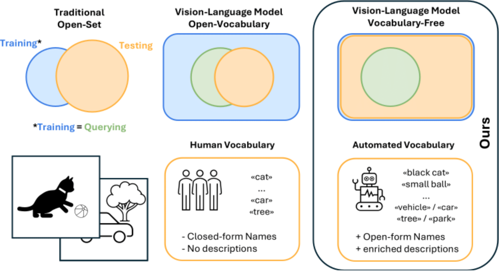

# From Open-Vocabulary to Vocabulary-Free Semantic Segmentation



This repository contains the **official code** for our paper:

**"From Open-Vocabulary to Vocabulary-Free Semantic Segmentation"**  
Published in *Pattern Recognition Letters*  
Paper link: https://www.sciencedirect.com/science/article/pii/S0167865525003101

> ⚠️ Note: This code builds upon a fork of **CAT-Seg** (https://github.com/cvlab-kaist/CAT-Seg)

------------------------------------------------------------
Installation
------------------------------------------------------------

1. Clone the repository:
   git clone git@github.com:klarareichard/open-vocab2free-seg.git
   cd open-vocab2free-seg

2. Create the conda environment:
   conda env create -f environment.yml
   conda activate open-vocab2free-seg

3. Install missing dependencies:

   ```bash
   conda install pytorch==1.13.1 torchvision==0.14.1 torchaudio==0.13.1 pytorch-cuda=11.7 -c pytorch -c nvidia
   python -m spacy download en_core_web_sm
   python -m spacy download en_core_web_trf
   conda install -c conda-forge gcc_linux-64=11 gxx_linux-64=11
   python -m pip install 'git+https://github.com/facebookresearch/detectron2.git@v0.6'
   pip install open-clip-torch
   ```
------------------------------------------------------------
Datasets
------------------------------------------------------------

Follow the CAT-Seg dataset setup instructions:  
https://github.com/cvlab-kaist/CAT-Seg/blob/main/datasets/README.md

**Datasets required:**
- Coco-Stuff
- ADE
- Pascal-VOC
- Pascal-Context 59

For vocabulary-free segmentation, we provide **JSON files** containing predicted class names and optional adjectives for each image. Place these JSON files in the corresponding dataset folder:  
datasets/coco/<your_json_files>.json

Download JSONs here:  
https://drive.google.com/drive/folders/11FmjAmnTpKnMXOisu1YCnf5oS5auE4FI?usp=sharing (subfolder: json)

------------------------------------------------------------
Usage
------------------------------------------------------------

Set your dataset path:
export DETECTRON2_DATASETS=/path/to/your/dataset/folder

**Evaluation**

Evaluate vocabulary-free semantic segmentation **without adjectives**:
CUDA_VISIBLE_DEVICES=0 sh eval_ade_150.sh configs/vitb_384_vocab.yaml 1 ade_vocab_free MODEL.WEIGHTS checkpoints/cat_seg.pth

**Notes:**
- vitb_384_vocab.yaml sets VOCAB_FREE=True
- Requires JSON file with class predictions (e.g., a-150_c_ram_a_llava_m_ST.json)

**Filename structure explained:**
- a-150: Dataset
- c_ram: Class name tagging algorithm (RAM)
- a_llava: Adjective generation model (LLava)
- m_ST: Algorithm for matching predicted classes to nearest class in vocabulary (Sentence Transformers)

Use adjectives: Set ADJ=True in the .yaml config. Default is ADJ=False.  
Perfect tagger case: Use ground-truth class names with vitb_384-gt_cls.yaml.

------------------------------------------------------------
🧠 Models
------------------------------------------------------------

We provide **pretrained models** used in our paper at the following Google Drive link:  
📂 [Pretrained Models on Google Drive](https://drive.google.com/drive/folders/1nCKz5BM--8vpBNN5PsDDpNU-Hk5DAEPf?usp=sharing)

Below is an overview of which models correspond to which experiments in the paper:

| **Table (Paper)** | **Model Name** | **Description** |
|-------------------:|----------------|-----------------|
| Table 1 & 2 | `cat_seg.pth` | CAT-Seg trained on **COCO-Stuff** |
| Table 3 | `cat_seg_gt.pth` | CAT-Seg trained **only on ground-truth classes per image** |
| Table 4 & 5 | `cat_seg_gt.pth` | Used for **Baseline** results |
| Table 4 & 5 | `cat_seg_blip_ca.pth` | Used for **Captions** results |
| Table 4 & 5 | `class_llava.pth` | Used for **Class Adjectives** results |
| Table 4 & 5 | `llava_query_new_trained_on_perfect_attr_gt.pth` | Used for **Instance Adjectives** results |

---

------------------------------------------------------------
🗂️ Class Name and Adjective JSON Files
------------------------------------------------------------

All JSON files for class names and adjectives are available in our  
📂 [Google Drive (JSON folder)](https://drive.google.com/drive/folders/11FmjAmnTpKnMXOisu1YCnf5oS5auE4FI?usp=sharing)

### 🐣 Chicken-and-Egg Experiments
Used in **Tables 1 & 2** of the paper.

**JSON file naming format:**
```
a-150_c_ram_a_llava_m_ST_thres_0.json
```

**Available for all datasets:**
```
a-150, pc-59, voc-20, a-847, pc-459
```

**Variants:**
- `c_ram` → RAM tagger  
- `c_cased` → CaSED tagger  
- `c_tag` → TAG tagger  

---

### ✨ Instance and Class Adjectives Experiments
Used in **Tables 4 & 5** of the paper.

**JSON file naming formats:**
- *Instance Adjectives:*
  ```
  a-150_c_gt_a_llava.json
  ```
- *Class Adjectives:*
  ```
  a-150_c_gt_a_general_llava.json
  ```

**Available for all datasets:**
```
a-150, pc-59, voc-20, a-847, pc-459
```


------------------------------------------------------------
Generating Class Names
------------------------------------------------------------

We provide all class names **JSON files** for each dataset in our Google Drive link:  
https://drive.google.com/drive/folders/11FmjAmnTpKnMXOisu1YCnf5oS5auE4FI?usp=sharing (subfolder: json)

The instructions below are only if you want to **generate the class names yourself**.

Supported taggers: RAM, LLAVA, CaSED, TAG

**RAM:**
1. Clone Recognize-Anything: git@github.com:xinyu1205/recognize-anything.git
2. Copy inference_dictionary_ram_plus.py from this repo into the Recognize-Anything folder
3. Run:
   python inference_dictionary_ram_plus.py --image-dir /path/to/images --output-json a-150_c_ram.json

**LLAVA:**
python llava_generate_class_names.py --dataset_short_name ade150

Ensure environment variables are set:
- DETECTRON2_DATASETS
- DATASET_SUBDIR_GROUNDTRUTH
- DATASET_SUBDIR_IMAGES

**CaSED & TAG:**
- CaSED: https://github.com/altndrr/vicss
- TAG: https://github.com/Valkyrja3607/TAG

Follow their repositories for dataset setup and class name generation.

------------------------------------------------------------
Generating Adjectives
------------------------------------------------------------

We provide adjectives in all JSON files. To generate with LLava:
python llava_generate_ram_adj_retry_mechanism.py --dataset_short_name ade150

Set environment variables as in Class Names Generation.

------------------------------------------------------------
Acknowledgements
------------------------------------------------------------

This project builds upon the work of **CAT-Seg: Cost Aggregation for Open-Vocabulary Semantic Segmentation**  
(https://github.com/cvlab-kaist/CAT-Seg), which is licensed under the MIT License.  
We thank the authors for their contributions.
